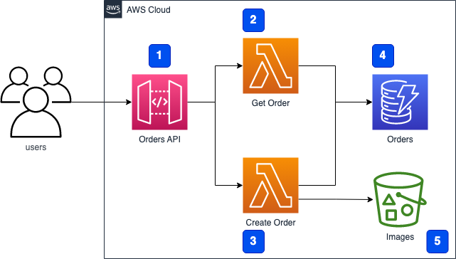

# Serverless AWS CDK Best Practices & Patterns with CDK Pipelines

An example of creating immutable builds using the AWS CDK and progressing them through environments to production using CDK Pipelines.


The article for this repo can be found here: https://leejamesgilmore.medium.com/serverless-aws-cdk-pipeline-best-practices-patterns-part-1-ab80962f109d

---

## Getting started

We are going to build the following basic application to showcase the use of CDK Pipelines:



**Note**: This is not production ready and is solely created for discussion points throughout the article.

---

## Deploying

We will deploy through the pipeline for feature-dev, staging and production, and also allow developers to use ephemeral environments based on their current pr number for quick dev environments (_as discussed in the article_).

---

### Deploying the pipeline

Firstly, we need to add the GitHub secret to AWS Secrets Manager in a secret called `github-token` as described here: https://docs.aws.amazon.com/cdk/api/v2/docs/aws-cdk-lib.pipelines.GitHubSourceOptions.html

To deploy the pipeline please run: `npm run deploy:pipeline` after adding your own account IDs in the `pipeline-types.ts` file.

Note: _to destroy please use the `npm run remove:pipeline' script_

---

### Deploying an ephemeral environment

To deploy a developer ephemeral environment:

1. Update the `.env` file and change the `PR_NUMBER` variable value.
2. Run the following command passing in your `PR_NUMBER` (example for 'PR-123' below):

```
cdk deploy ServerlessPro/Develop-PR-123/StatefulStack ServerlessPro/Develop-PR-123/StatelessStack --profile=featuredev
```

Note: _There is an example of this and the tear down in the package.json file for reference. This could easily be scripted_.

---
